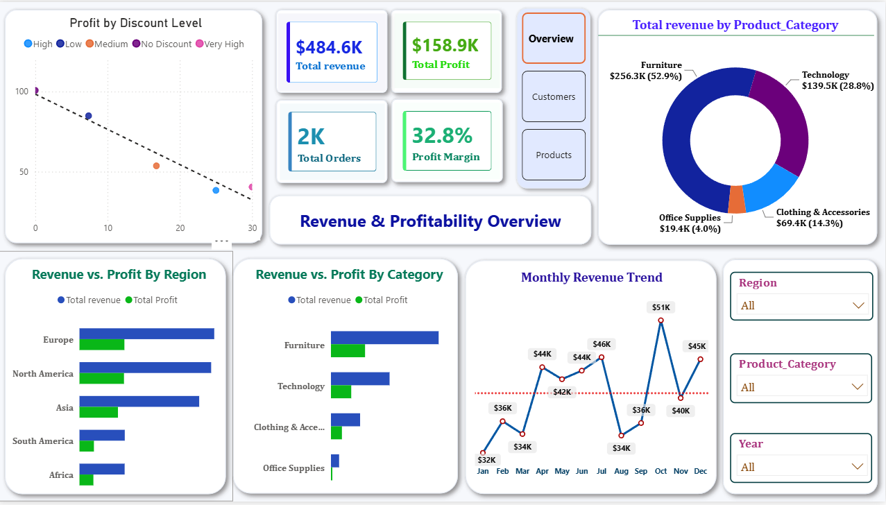
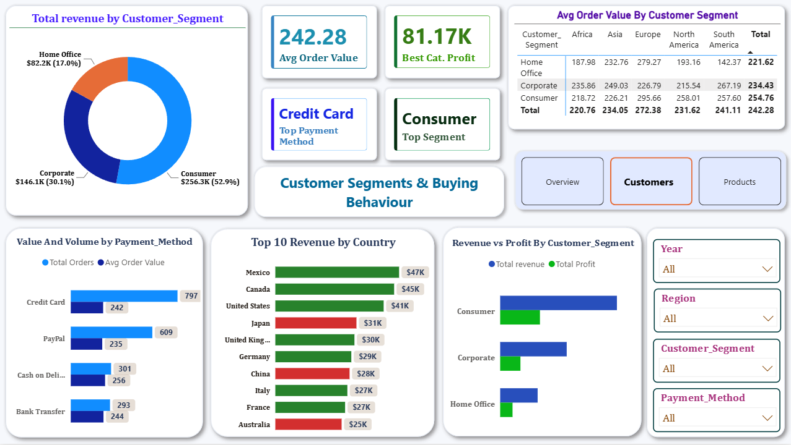
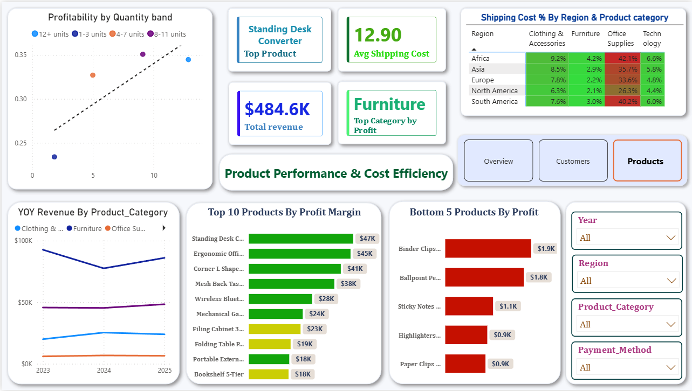

# Global E-Commerce Sales Performance Dashboard | Power BI

A stakeholder-driven Power BI dashboard analyzing 2,000 global e-commerce transactions (2023–2025) to uncover revenue trends, customer value, and cost efficiency across regions, categories, and segments.

## Table of Contents

- [Overview](#overview)
- [Business Problem](#business-problem)
- [Dataset](#dataset)
- [Tools & Technologies](#tools--technologies)
- [Project Structure](#project-structure)
- [Data Preparation & Formatting](#data-preparation--formatting)
- [Research Business Questions & Key Filtering](#research-business-questions--key-filtering)
- [Dashboard](#dashboard)
- [How to Run This Project](#how-to-run-this-project)
- [Final Recommendations](#final-recommendations)
- [Author & Contact](#author--contact)

## Overview

This project turns a raw e-commerce transactions dataset into a decision-ready Power BI report. Instead of building charts for the sake of covering the data, every visual on every page was designed around a specific business question a stakeholder — a CFO, a marketing lead, an operations manager — would actually need answered.

The report is split across three pages: **Overview** (revenue and profitability), **Customers** (segments and buying behaviour), and **Products** (product performance and cost efficiency). Across the three pages, the analysis covers 12 distinct business questions, each backed by a purpose-built visual, a DAX measure where needed, and formatting choices (conditional colors, reference lines, heatmaps) that make the finding obvious at a glance rather than something the viewer has to dig for.

The value of this project is less "here's a dashboard" and more "here's how a business would actually use this data to make a decision" — which is the mindset the dashboard was built with from the start.

## Business Problem

An e-commerce business with operations across 5 regions and 20 countries needed a way to answer a recurring set of questions that were otherwise scattered across raw transaction data:

- Which product categories and individual products are genuinely profitable, versus which only look good on revenue?
- Is discounting helping or quietly destroying margin, and at what point does a discounted order become a loss?
- Which customer segments and countries deserve more marketing investment, and which are being over-served?
- Is shipping cost eating into profit in specific regions or categories without anyone noticing?
- Are bulk orders actually more profitable, or does the discount attached to them cancel out the benefit?

Each of these is a real operational or financial decision, and the dashboard was built specifically to give a fast, confident answer to each one.

## Dataset

The dataset (`global_ecommerce_sales.csv`) contains 2,000 e-commerce order records spanning January 2023 to December 2025, across 5 regions and 20 countries.

Key columns:

| Column | Description |
|---|---|
| `Order_ID` | Unique identifier for each order |
| `Order_Date` | Date the order was placed |
| `Total_Sales` | Revenue generated by the order |
| `Profit` | Profit generated by the order |
| `Discount_Percent` | Discount applied to the order |
| `Shipping_Cost` | Cost of shipping the order |
| `Quantity` | Number of units in the order |
| `Product_Name` | Name of the product sold |
| `Product_Category` | Category the product belongs to (4 categories) |
| `Customer_Segment` | Consumer, Corporate, or Home Office |
| `Country` | Country the order was placed in |
| `Region` | Region the country belongs to (5 regions) |
| `Payment_Method` | Payment method used for the order |

## Tools & Technologies

- **Power BI Desktop** — data modeling, DAX measures, report design, and interactivity
- **Power Query** — data preparation and shaping, used entirely within Power BI
- **DAX** — for all calculated measures (revenue, profit margin, YoY growth, shipping cost %, etc.)
- **Excel/CSV** — original source format of the dataset

## Project Structure

```
global-ecommerce-sales-dashboard/
├── README.md
├── Dashboard/
│   └──Global-Ecommerce-Sales-Dashboard.pbix
├── data/
│   └── global_ecommerce_sales.csv
└── Images/
    ├── 01-overview.png
    ├── 02-customers.png
    └── 03-products.png
```

## Data Preparation & Formatting

The dataset came in largely clean, so deep data cleaning wasn't the focus of this project — the real work was in shaping and formatting it correctly inside Power BI so the model would support accurate, drillable analysis. All of this was done in Power Query and the Power BI data model, including:

- Verifying column data types (dates as Date, monetary fields as Decimal Number, percentages formatted correctly) so DAX measures would calculate correctly
- Building a dedicated **Date table** using `CALENDARAUTO()`, marking it as the official date table, and relating it to `Order_Date` — required for month-level drill-down and year-over-year comparisons to work properly
- Creating calculated columns for banding continuous fields into readable groups, such as **Discount Band** (No discount / Low / Medium / High / Very high) and **Quantity Band** (1–3 units through 12+ units), so scatter charts could be grouped and colored meaningfully instead of showing 2,000 individual unlabeled points
- Structuring all core DAX measures (Total Revenue, Total Profit, Profit Margin %, Avg Order Value, Shipping Cost % of Sales) using `DIVIDE()` throughout instead of raw division, to avoid errors on zero-value rows
- Applying consistent naming conventions across measures so the model stays readable and reusable across all three report pages

## Research Business Questions & Key Filtering

**Page 1 — Revenue & Profitability**
- Which product categories generate the highest revenue and profit, and which are loss-making? — filtered and colored by a Profit < 0 conditional rule to flag loss-making categories automatically
- How has revenue trended month-over-month across 2023–2025? — filtered by the Date table, with a constant average-revenue reference line to separate strong months from weak ones
- Which regions contribute the most to revenue and profit? — cross-filtered map and bar chart by Region
- At what discount level does profit turn negative? — filtered using the Discount Band groups, with a break-even (zero profit) reference line

**Page 2 — Customer Segments & Buying Behaviour**
- Which customer segment drives the most revenue and profit? — filtered by Customer_Segment across a donut and bar combination
- Which countries are the top 10 revenue contributors? — filtered using a Top N (10) filter on Country by Total Revenue, narrowed down from 20 countries
- Which payment methods are most used, and do they correlate with order value? — filtered by Payment_Method, sorted by order count
- How do order value and profit differ across segments and regions combined? — filtered through a Customer_Segment × Region matrix heatmap

**Page 3 — Product Performance & Cost Efficiency**
- Which products generate the highest revenue, and which have the worst margins? — filtered with a Top N (10) filter by revenue, plus a separate Bottom 5 filter by profit margin
- Is shipping cost eating into profit by category and region? — filtered through a Region × Product_Category heatmap on Shipping Cost % of Sales
- Does higher quantity per order improve profitability? — filtered using the Quantity Band groups, comparing margin percentage rather than raw profit
- Which categories show the strongest year-over-year revenue growth? — filtered by Date[Year] with a YoY growth measure applied

All three pages share a common slicer panel (Year, Region, Product_Category, Payment_Method) so any finding can be re-checked from a different angle without leaving the page.

## Dashboard

The report is built as a 3-page interactive Power BI dashboard:

---
**Overview** — Total revenue ($484.6K), total profit ($158.9K), total orders (2,000), and overall profit margin (32.8%) sit at the top as KPI cards. Below them: a revenue-by-category donut, a monthly revenue trend line with an average-benchmark reference line, and side-by-side region and category comparisons of revenue versus profit.




---

**Customers** — KPI cards for average order value ($242.28), best category profit, and top segment/payment method, followed by a revenue-by-segment donut (Consumer leads at 52.9%), a top-10 countries by revenue chart, a payment method comparison, and a segment-by-region average order value matrix.





---
**Products** — KPI cards for the top product (Standing Desk Converter), average shipping cost ($12.90), and top category by profit (Furniture), followed by a top-10 vs bottom-5 products by profit margin comparison, a region-by-category shipping cost heatmap, and a quantity-vs-profitability scatter plot.




---
All three pages are cross-filterable — clicking any region, category, or segment on one visual filters the rest of the page, and the shared slicer panel lets any question be re-examined by year, region, category, or payment method without switching pages.

## How to Run This Project

1. Clone or download this repository
   ```
   git clone https://github.com/your-username/global-ecommerce-sales-dashboard.git
   ```
2. Make sure you have **Power BI Desktop** installed (free download from Microsoft)
3. Open `Global-Ecommerce-Sales-Dashboard.pbix` in Power BI Desktop
4. Use the page tabs (Overview / Customers / Products) at the bottom to navigate between report pages
5. Use the slicer panel on the right of each page to filter by Year, Region, Product Category, or Payment Method
6. If you don't have Power BI Desktop, the `screenshots/` folder contains static images of all three pages, and the raw data is available in `data/global_ecommerce_sales.csv` for review in Excel or any spreadsheet tool

## Final Recommendations

- **Reassess discounting above the break-even threshold.** The discount-vs-profit analysis shows profit turning negative past a certain discount level — capping discounts below that threshold on affected categories would protect margin without losing the sales volume benefit.
- **Investigate shipping cost in high-cost region/category combinations.** Shipping cost as a percentage of order value spikes to over 40% in some region-category pairs (e.g. Office Supplies in Africa) — this is a strong candidate for renegotiating carrier rates or adjusting pricing for those specific combinations.
- **Prioritize marketing spend toward the Consumer segment**, which drives over half of total revenue, while monitoring whether Corporate and Home Office segments justify their current share of spend given their smaller contribution.
- **Double-check margins on high-revenue, low-margin products.** Several top-10 products by revenue don't appear in the top-10 by profit margin — these are worth a pricing or cost review since they're moving volume without moving proportional profit.
- **Use the shared slicers to monitor bulk order profitability going forward**, since the quantity-vs-margin analysis suggests bulk discounting may be trimming the benefit of larger orders — worth tracking as order volumes grow.

## Author & Contact

**Rishabh Mishra**

Data Analyst | Power BI Developer | SQL Developer

- Email: [rm257792@gmail.com]
- [LinkedIn](linkedin.com/in/rishabh-mi)
